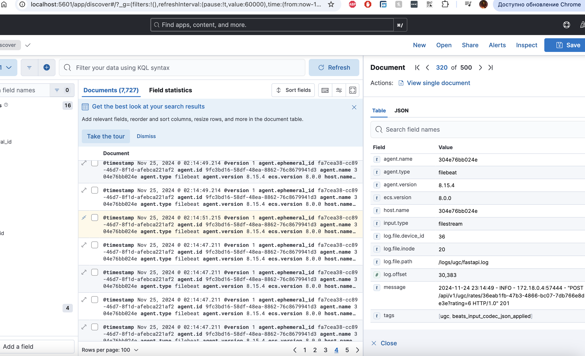

#### Ссылка на репозиторий
```bash
https://github.com/ilyinon/ugc_sprint_2
```

#### Исследование
Документация по сравнению PostgreSQL и MongoDB  находится в каталоге research
[research/Research.md](research/Research.md)


####  Запуск проекта


##### скопировать конфиг
```bash
cp .env_example .env
```

##### запустить nginx и mongo
```bash
make infra
```

##### запустить ugc
```bash
make ugc
```

##### сгенерировать тестовый access_token
```bash
docker exec  ugc_sprint_2-ugc2-1 python cli/generate_access_token.py
```

##### UGC OpenAPI
```bash
http://localhost/api/v1/ugc/openapi
```


#### CI

Добавлена автоматическая проверка проекта средствами isort, flake8 и mypy.
Результат приходит оповещением в ТГ канал, и инфографикой в MR и master бранче.

[.github/ugc.yml](.github/ugc.yml)


#### Логи

Запустить стек ELK
```bash
make elk
```

Поднят ELK. Логи приходят через подключенные volume. На мой взгляд это не самый оптимальный подход, обычно логи снимаются с output. Но на ноуте с маком в связке с docker-compose возникли различного рода проблемы со снятием логов с output, и была реализована подобная связка. Логи для UGC приложения пишутся в файл.

В целом схема выглядит так:
Приложения пишут логи в файл, который читается filebeat, который навешивает нужные тэги и отправляем в logstash. Далее logstash загружает логи по тэгам в нужные индексы. Для хранения используется Elastic. Доступ в Elastic через Kibana.

Сама Kibana


Пример записи лога в индексе

